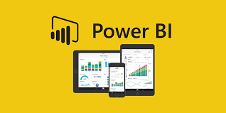

# Power BI - Financials Data Analysis

    

This project showcases using Power BI to analyze and visualize financial performance data. It includes a sample dataset (financials) containing key financial indicators and demonstrates how to complete data summaries and build interactive dashboards that support data-driven decision-making.

### Dataset Description
- The dataset is a sample data from Microsoft Power BI.
- It captures transactional and financial performance metrics for product sales across multiple countries and time periods. Each row represents a unique sales transaction/aggregate record, with key attributes.

**🏷️ Fields/Columns**
- Segment – Market segment category (e.g., Consumer, Corporate, Home Office).
- Country – The nation where the sale occurred (e.g., Canada, Germany).
- Product – Name or type of product sold.
- Discount Band – The discount category applied (e.g., None, Medium, High).
- Units Sold – Number of product units sold in the transaction.
- Manufacturing Price – Cost to produce one unit of the product.
- Sale Price – The listed selling price before discounts.
- Gross Sales – Total revenue before discounts (Units Sold × Sale Price).
- Discounts – Total value of discounts applied.
- Sales – Actual revenue after discounts (Gross Sales − Discounts).
- COGS (Cost of Goods Sold) – Total cost to produce the units sold.
- Profit – Net profit from the transaction (Sales − COGS).
- Date, Month Number, Month Name, Year – Temporal indicators for time-series analysis.

**NOTE:**

- All workings, and analysis are done in the [financials pbix file](/financials.pbix), with sample output displayed.

## 📊 [Dashboard Features]()
- Interactive charts for revenue, profit, and sales trends.
- Slicers for filtering by country, segment, product, and time period.
- KPI cards for quick insights (Total Sales, Profit Margin, Units Sold).
- Drill-through pages for detailed transaction analysis.

## 🧮 [DAX Calculations](/DAX/)
- Custom measures for year-over-year growth, profit margin, and average discount.
- Time intelligence functions for monthly, quarterly, and yearly comparisons.
- Dynamic ranking of top products and countries.

## 📈 [Visualizations]()
- Bar and line charts for trend analysis.
- Pie and donut charts for segment distribution.
- Matrix and table visuals for detailed breakdowns.
- Map visual for geographic sales performance.

## 🛠️ [How to Use]()
1. Open `financials.pbix` in Power BI Desktop.
2. Explore the dashboard tabs for different analyses.
3. Use slicers and filters to customize your view.
4. Review DAX formulas in the DAX folder for custom calculations.

## 📂 [Folder Structure]()
- `financials.pbix` – Main Power BI report file.
- `DAX/` – Contains DAX formulas and documentation.
- `imgs/` – Dashboard screenshots and visuals.

## 📚 References
- [Power BI Documentation](https://docs.microsoft.com/power-bi/)
- [DAX Guide](https://dax.guide/)
- [Sample Dataset Source](https://learn.microsoft.com/power-bi/create-reports/sample-datasets)

## Read More
- Interested in other programming, business, and social stories, check out the [MEDIUM Page](https://medium.com/me/stories/drafts)